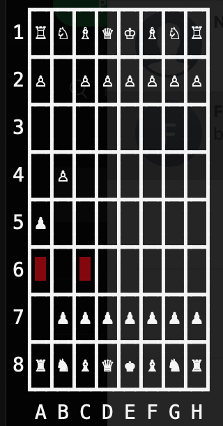

# Command Line Chess Game

How To Play:

`$ ruby chess.rb` 

# Features

* Each Piece Has His Own Movement
* Each Piece Has To Make Legal Move
* En-Passant
* Castling
* Stalemate
* Check
* Checkmate
* 50 Move Rule
* Ultra Basic AI
* Shows Moves With Red Background

# TODO
* Save - Load Function

